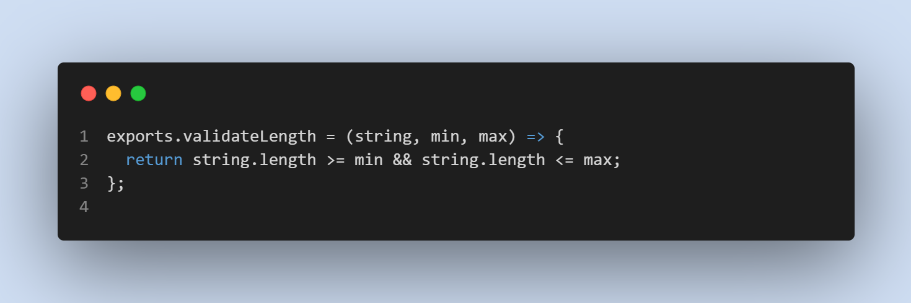

# Facebook Server

## Description

It is a custom server that can be used to create update delete user and run the facebook clone application.

## Email Validation (./helpers/Validation.js)


## Length Validation (./helpers/Validation.js)



## User Model Schema (./models/user.js)


## Username Validation (./helpers/Validation.js)


## JWT Token (./helpers/token.js)

- Generate Token
  
- Token Generator
  

## Email Verification (./helpers/mailer.js)

- UserController.js
  
- Mailer
  

  ## Account Activation (./controller/user.js)


## Server.js


## Requirements

- [x] Node.js
- [x] Express.js
- [x] MongoDB
- [x] React.js

## Start

```javascript
cd backend
npm install
npm run server
```

```javascript
cd frontend
npm install
npm start
```

## Server Code

```javascript
200 - OK
201 - Created
202 - Accepted
204 - No Content
400 - Bad Request
401 - Unauthorized
403 - Forbidden
404 - Not Found
500 - Internal Server Error
501 - Not Implemented
502 - Bad Gateway
503 - Service Unavailable
504 - Gateway Timeout
505 - HTTP Version Not Supported
506 - Variant Also Negotiates
507 - Insufficient Storage
508 - Loop Detected
510 - Not Extended
511 - Network Authentication Required
599 - Network Connect Timeout Error
599 - Network read timeout error
```
