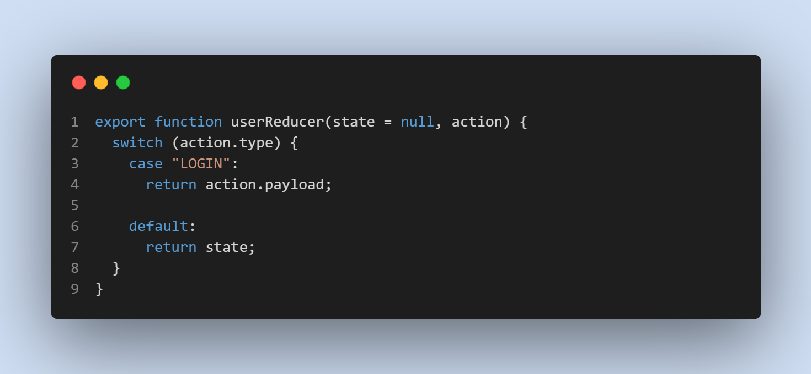
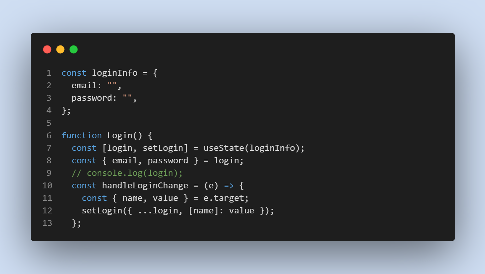

# Front End Development

## Index.JS setup


## App.js setup


## User Reducer Basic Setup



## Login Handler Function On Change Input



## Server Start & build

```bash
npm start
npm run build
```
