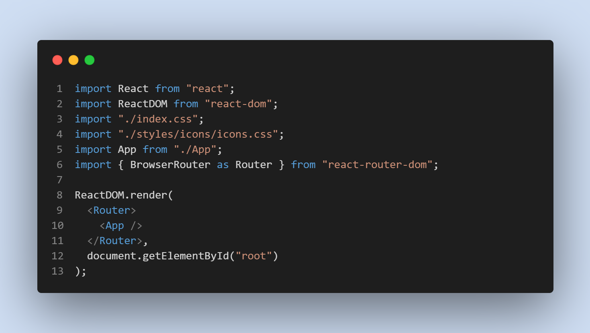

# Front End Development

## Index.JS setup



## App.js setup


## User Reducer Basic Setup


## Login Handler Function On Change Input


## Server Start & build

```bash
npm start
npm run build
```

## Social Media

<a href="https://facebook.com/mejanur.mezan.3"></a> &nbsp;
<a href="https://twitter.com/MejanurMezan"></a> &nbsp;
<a href="https://www.linkedin.com/in/mejanur-rahman-061998/"></a> &nbsp;
<a href="https://instagram.com/mejanur.mezan.3"></a> &nbsp;
